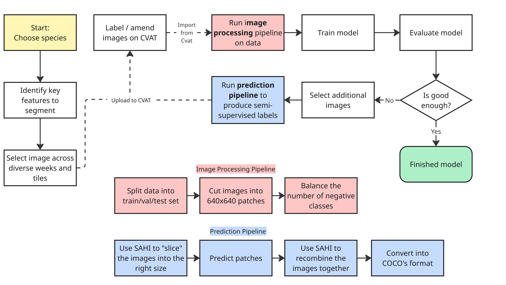

# CGRAS Settler Counter

**Coral Growout Robotic Assessment System (CGRAS) Settler Counter**  
This repository contains code to count coral settlers on settlement tiles using semantic segmentation image.

Last updated: Aug 2025
---
## Getting started with the machine learning pipeline 
This section is to serve as a quick start for getting familiar and utilising the core processes of the repo as per the image below:



### The first script within the creation process is the [image processing pipeline](image_processing/scripts/image_processing.py).
- This script takes full sub images then processes the images into 640x640 "patches" that then can be used by the model.
- The input of these script is a config file specifying i/o directories as well as controlling how the operations are applied, [you can see examples here.](image_processing/config)
  
Example usage
```bash
python image_processing/scripts/image_processing.py --config image_processing/config/2025_genera_model.yaml 
```

This script then outputs a folder with a similar file directory:
```
Project_name
├── cgras_data.yaml
├── test_0
│   ├── images
│   └── labels
├── train_0
│   ├── images
│   └── labels
└── valid_0
    ├── images
    └── labels
```
The next step is then to train the model itself

The project utilises ultralytics libary to compile and load the model, [the full documentation can be found here.](https://docs.ultralytics.com/modes/train/#train-settings) 

Similarly, [the training script](segmenter/scripts/train.py) also utilises a config script which modifies the [ultralytics training settings](https://docs.ultralytics.com/usage/cfg/#train-settings) as well as specifing the path to cgras_data.yaml. 

Depending on hardware, batchsize and many other factors, training time can signifacntly vary, current model training times are ~19 hours, 76 epoches. 

Example usage
```bash
python segmentation/scripts/train.py --config segmentation/config/2025_genera_model.yaml 
```
Evaluating

For assessing model performance there are a few scripts useful scripts:
Quantative 
- [Loss curve](segmenter/scripts/generateLossCurve_seg.py) 
- [Confusion Matrix](analysis/Conf_matrix.py)
- [val_yolo.py](segmenter/scripts/val_yolo.py)
Qualatative 
- [view_predictions.py](analysis/view_predictions.py): Visulising labels and model predictions overlaped.
- [test_image.py](segmenter/scripts/test_image.py): Visualising labels and predictions side by side.  

Building semi-supervised labels 
prediction pipeline 

## Code Layout

### Analysis
- **`Conf_matrix`**: Use a YOLO model to predict on a given dataset and save a confusion matrix of performance metrics.
- **`NegDataimages.py`**: Define classes used in `Conf_matrix.py` and conduct FP/FN Analysis
- **`config_matrix_analyzer.py`**: Compare predicted labels with ground truth labels to determine performance metrics.
- **`view_predictions.py`**: Visualises prediction results using a trained YOLO model.
---

### Annotation
- **`CVAT_class_constructor.json`**: Defines CVAT classes and colors for CGRAS.  
- **`cvat1.1_to_yolo.py`**: Converts a CVAT dataset to YOLO format.  
- **`cvatcoco_to_yolo.py`**: Converts a COCO dataset to YOLO format.  
- **`predict_boxes.py`**: Saves predicted bounding box results as `.txt` and `.jpg`.  
- **`predict_to_cvat.py`**: Runs a trained YOLOv8 segment model on unlabeled images, saving results in CVAT annotation format (for human-in-the-loop processing).  
- **`relabel.py`**: Script to fix or change class labels of a dataset.  
- **`roboflow_sahi.py`**: Implements SAHI for image processing, useful for visualization or human-in-the-loop tasks via CVAT.  
- **`run_predict.sh`**: Bash script to batch process the `predict_to_cvat` script.  
- **`Utils.py`**: Contains class definitions and utility functions for other scripts.  
- **`view_predictions.py`**: Visualizes prediction results using a trained YOLOv8 weights file.

- **`predict_pipeline.py`**: Runs full prediction pipeline using instructions from a config file.
- **`config_temp.yaml`**: Lays out required parameters to run prediction process, including different use cases.
- **`combine_coco_edits`**: Combines two COCO datasets, replacing outdated labels with updated labels from the secondary dataset.
- **`sahi_predict_edits`**: Runs a trained YOLOv8 segment model on unlabeled images, saving result in CVAT annotation format.
- **`fix_coco_json_edits`**: Fixes COCO JSON files by removing invalid annotations.

---

### Archive
- **`relabel_seg_to_single_class.py`**: Converts YOLO segmentation labels with multiple classes into a single class.  
- **`segTOclassifier.py`**: Processes YOLO segmentation data to generate cropped images for specific class instances.

---

### Docs
- **`cvat_notes.md`**: Instructions regarding how to locally host CVAT
- **`HPC_Notes.md`**: Instructions regarding the use of the HPC
- **`Human_in_the_loop.md`**: Instructions regarding the labelling and training processes
- **`image_processing.md`**: Instructions regarding the process of image splitting to prepare for training

---

### Experiments


---

### General Scripts


---

### HPC
- **`hpc_submit_gpu.bash`**: Request GPU resources on the Aqua HPC
- **`hpc_submit_cpu.bash`**: Request CPU resources on the Aqua HPC
- **`image_split_hpc.bash`**: Request resources and run the image splitting pipeline on the Aqua HPC
- **`train_hpc.bash`**: Request resources and run the training pipeline on the Aqua HPC

---


### Image Processing
Functions and scripts for processing images:  
- **`extract_imgs.py`**: Extracts images from CGRAS data samples into a structured folder format for detection.  
- **`splitfiles.py`**: Splits a dataset into training, testing, and validation sets.  
- **`tiling_images.py`**: Tiles large images into smaller ones with annotations for YOLO model training.  

- **`image_processing.py`**: Splits CVAT export images into 640x640px patches.
- **`select_images.py`**: Selects desired images from datasetand copies to a separate location.
- **`folder_structurer.py`**: Defines a class to validate, convert, and visual CVAT exports for YOLO training.
- **`filterer.py`**: Defines a class to analyse and filter YOLO training data based on label characteristics.
- **`data_splitter.py`**: Defines a class to split YOLO datasets into train, validation, and test sets.
- **`image_patcher.py`**: Defines a class to split images into square 640px patches, transferring labels to new related txt files.

#### ROI and ImageJ Tools
- **`convert_tif2jpg.py`**: Converts TIFF files to JPG format.  
- **`pde_to_cvat.py`**: Converts ROI PDE data to CVAT format.  
- **`ROI_2_CSV.py`**: Converts ROI PDE data to CSV format.  
- **`run_ROI_2_CSV.py`**: Bash script for batch processing ROI to CSV conversion.

---

### Repo Info
- **`environment.yml`**: Lists all packages required by the CGRAS_CORAL_DETECTION repo.
- **`make_cgras_venv.sh`**: Creates the cgras environment using packages listed in `environment.yml`.

---

### Resolution Experiment
- **`remove_too_many_negs.py`**: Removes negative (unlabeled) images from a dataset.  
- **`resize-files.py`**: Resizes data files to specified resolutions for training experiments.  
- **`resolution_script.py`**: Script for testing the impact of different resolutions on model performance.

---

### Segmenter
Scripts for training and predicting coral settlers using a YOLO model:  
- **`cgras_20230421.yaml`**: YAML file specifying training data locations.  
- **`cgras_hpc.yaml`**: YAML file for HPC data paths.  
- **`cgras_Pde_20230421.yaml`**: YAML file specifying PDE data locations.  
- **`Pdae_train_segmenter.py`**: Code for training a YOLO model using PDE data.  
- **`predict_segmenter.py`**: Code for predicting corals in images.  
- **`train_segmenter.py`**: Script to train a YOLO model on a dataset.  
- **`val_segmenter.py`**: Evaluates test data to measure model performance.

- **`train.py`**: Script to train a YOLO model on a dataset.
- **`val.py`**: Compares model predictions with ground truth labels.
- **`val_yolo`**: Determine performance metrics for a YOLO model validated on a dataset.

---

### Legacy Code
- **`Annotations.py`**: Tests SAM annotation.  
- **`poly_to_mask.py`**: Converts polygons to masks for CVAT annotation.  
- **`till_n_predict.py`**: Tiles large images and visualizes model predictions.  
- **`min_res.py`**: Runs experiments to determine the minimum resolution for coral detection.  
- **`segment_cgras_images.py`**: Tests SAM annotations.  
- **`original_sahi_yolov8`, `updated_sahi_yolov8`**: Updates to YOLOv8 SAHI model, later superseded by `roboflow_sahi`.  
- **`temp_calc.py`**: Uses confusion matrices to compute YOLO model performance metrics.

---